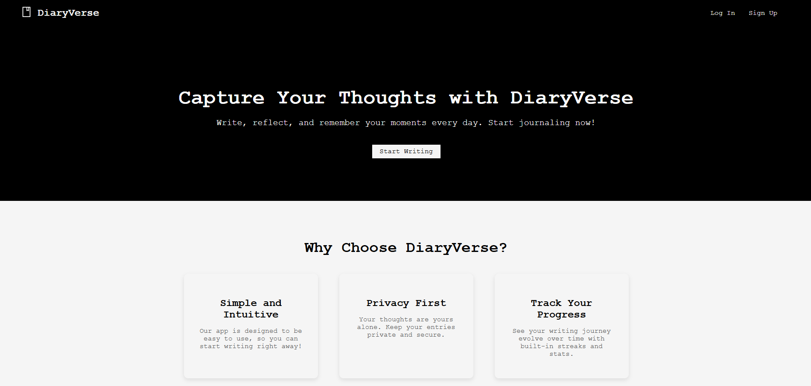
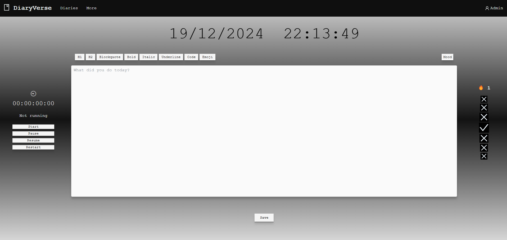
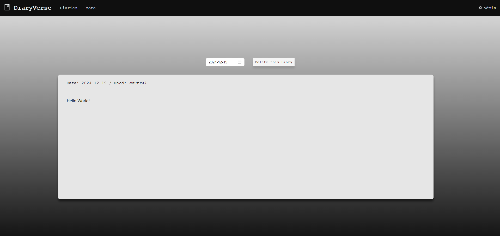
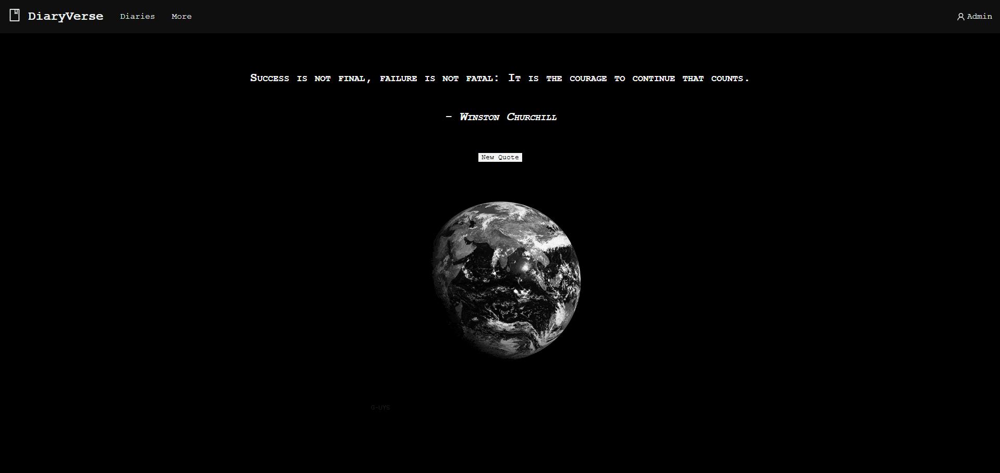

## DiaryVerse
DiaryVerse is a web application for writing and maintaining a personal diary. It helps users document their daily experiences, track their moods, maintain writing streaks, and revisit past entries for reflection and growth.
 
## Table of Contents
- [Description](#description)
- [Features](#features)
- [Installation](#installation)
- [Contributing](#contributing)
- [License](#license)
- [Acknowledgments](#acknowledgments)
- [Contact Information](#contact-information)
- [Images](#images)
- [Notes](#notes)

## Description
DiaryVerse is your digital diary companion, designed to encourage consistent journaling. With features like mood tracking, streak counting, and entry visualization, it’s more than just a writing tool—it’s a journey through your personal growth and daily reflections.

With DiaryVerse, you can:

- Write daily diary entries to capture your thoughts and experiences.

- Maintain streaks to build a consistent journaling habit.

- Track your daily mood and observe patterns over time.

- Revisit and reflect on past entries to see how far you’ve come.


## Features
- Daily Journaling: Write and save your thoughts and experiences every day.

- Streak Tracking: Keep track of consecutive days of journaling to stay motivated.

- Mood Tracking: Record your daily mood.

- Entry History: Easily access and revisit past entries.

## Installation

Prerequisites

- Node.js and npm installed

- Python 3.8 or higher installed

- Git installed

## Installation
1. Clone the repository:
   ```bash
   git clone https://github.com/Tugay72/DiaryVerse.git
2. Navigate to the project directory:
   ```bash
   cd DiaryVerse
3. Install dependencies (if applicable):
   ```bash
   cd frontend
   npm install
4. Install dependencies for the backend:
   ```bash
   cd ../backend
   npm install


## Contributing
1. Fork the repository.
2. Create a new branch
   ```bash
   git checkout -b feature-branch

3. Make your changes.
4. Commit your changes
   ```bash
   git commit -m 'Add some feature'
5. Push to the branch
   ```bash
   git push origin feature-branch).
6. Create a new Pull Request.

## License
This project is licensed under the Creative Commons Attribution-NonCommercial 4.0 International License. See the LICENSE file for details.

## Acknowledgments
Ant Design for some of the UI components.
Drajt.js for richtexteditor.

## Contact Information
Project Link: https://github.com/Tugay72/DiaryVerse

## Images












## Notes
Adjustments: Modify the installation and usage instructions based on the actual setup for your project, especially if you're using specific frameworks or technologies.
Licensing and Acknowledgments: This project uses a Creative Commons NonCommercial License.
